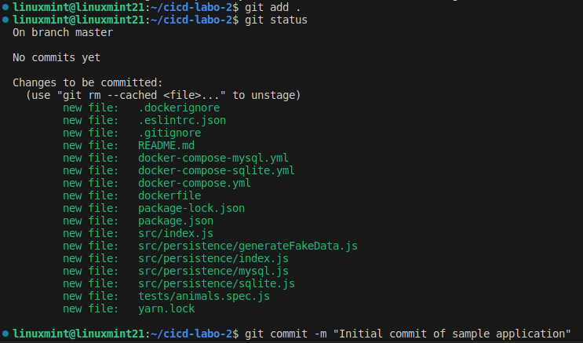
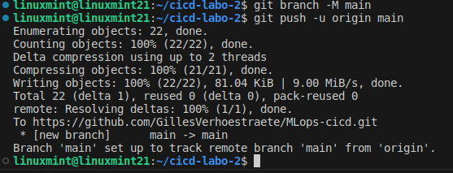
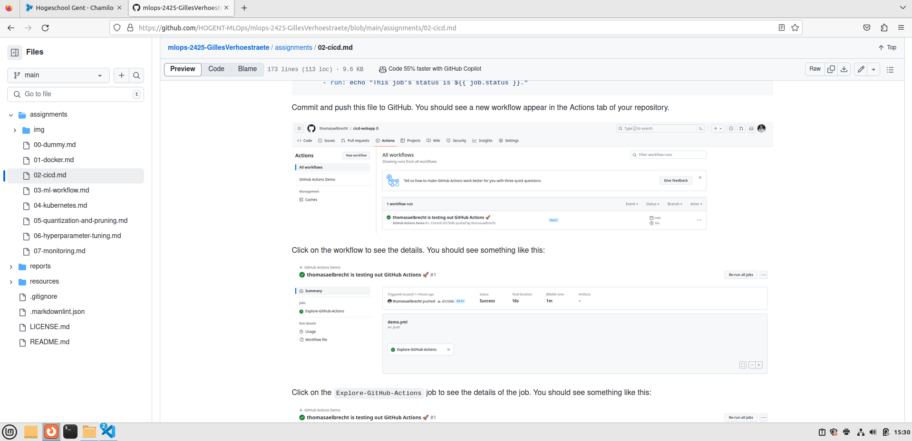

# Lab Report: SUBJECT

## Student information

- Student name: Gilles Verhoestraete
- Student code: 202289627

## Assignment description

Describe the assignment in your own words. What did you have to do? What was the goal of the assignment?

## Proof of work done

Include screenshots, code snippets, etc. to prove that you completed the assignment. If you have a lot of code, you can link to a separate file or repository.

### 1.1 Create a GitHub repository for the sample application

Ik heb mijn naam en email ingesteld zodat het dezelfde zijn als op github door deze code:

```a
git config --global user.name "GillesVerhoestraete"
git config --global user.email "gilles.verhoestraete@student.hogent.be"
```

daarna heb ik de inhoud van mijn webapp map gekopieerd naar een andere map op mijn systeem.

hierna heb ik in de nieuwe map `git init` gebruikt om een nieuwe Git-repository te initialiseren. Daarna heb ik `git add .` gebruikt om om wijzigingen in de werkdirectory aan de staging area toe te voegen in een Git-repository. Dan heb ik `git status` gebruikt om te kijken dat ik zeker geen database bestand heb toegevoegd. Dit was het niet geval



Hierna heb ik de wijzigingen gecommit `git commit -m "Initial commit of sample application"`. Dan heb ik de nieuwe remote repository toegevoegd aan de lokale Git-repository aan de hand van `git remote add origin https://github.com/GillesVerhoestraete/MLops-cicd.git`. Dan noem ik de branch 'main' aan de hand van deze code `git branch -M main`. Uiteindelijk push ik de code naar github aan de hand van `git push -u origin main`.



### 1.2 Create a new GitHub Actions workflow

Ik heb een `demo.yml` bestand gemaakt in de volgende map: .github/workflow met het volgende code in:

```a
---
name: GitHub Actions Demo
run-name: ${{ github.actor }} is testing out GitHub Actions 🚀
on:
  push:
    branches:
      - main
jobs:
  Explore-GitHub-Actions:
    runs-on: ubuntu-latest
    steps:
      - name: Check out repository code
        uses: actions/checkout@v3
      - name: List files in the repository
        run: |
          ls ${{ github.workspace }}
      - run: echo "This job's status is ${{ job.status }}."
```

daarna heb ik deze nieuwe wijzigingen gepushed naar github.



## Evaluation criteria

Copy the acceptance criteria from the assignment into this section using a [task list](https://docs.github.com/en/get-started/writing-on-github/getting-started-with-writing-and-formatting-on-github/basic-writing-and-formatting-syntax#task-lists).
Check the boxes that apply. Provide a brief explanation for each box you **didn't** check.

The list below is an example. Replace it with the entire section with the actual acceptance criteria.

- [x] The report is written in Markdown
- [ ] The container is running: I couldn't get it to work because the container image is not available

## Issues

List any issues encountered while completing the assignment, with a brief description of what went wrong and how you fixed it (if you were able to fix it yourself). If not, describe how far you got and what prevented you from continuing. Include error messages, screenshots, etc.

If you did not encounter any problems, write "none".

## Reflection

What was difficult? What was easy? What did you learn from the assignment? What would you do differently if you had to do it over? If you have any other remarks, feel free to share them.

## Resources

List all sources of useful information that you encountered while completing this assignment: books, manuals, HOWTO's, blog posts, etc.
